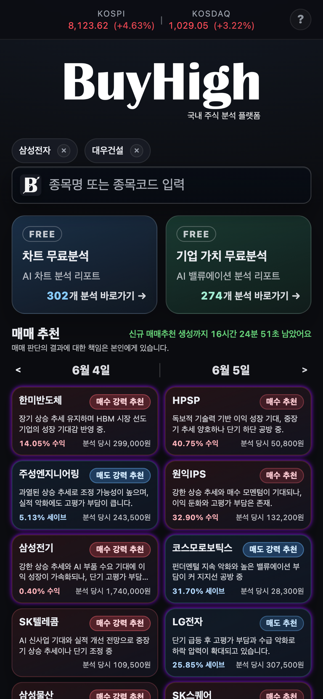
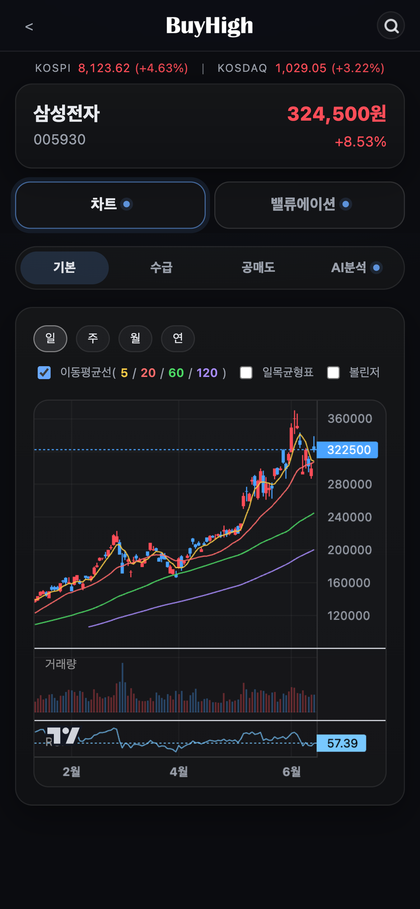
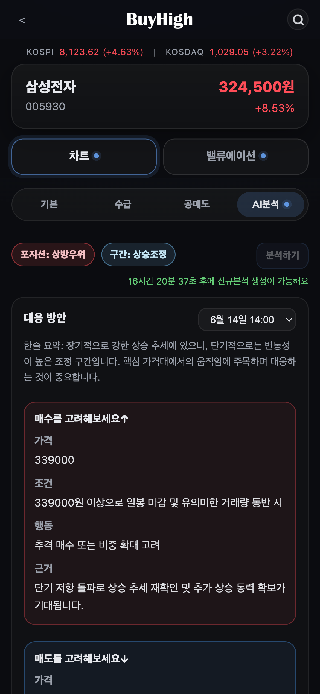
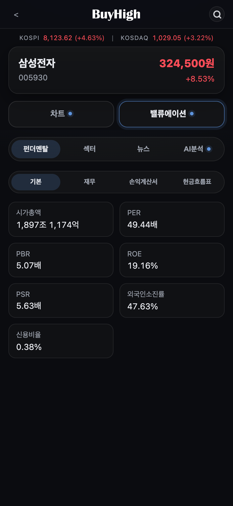
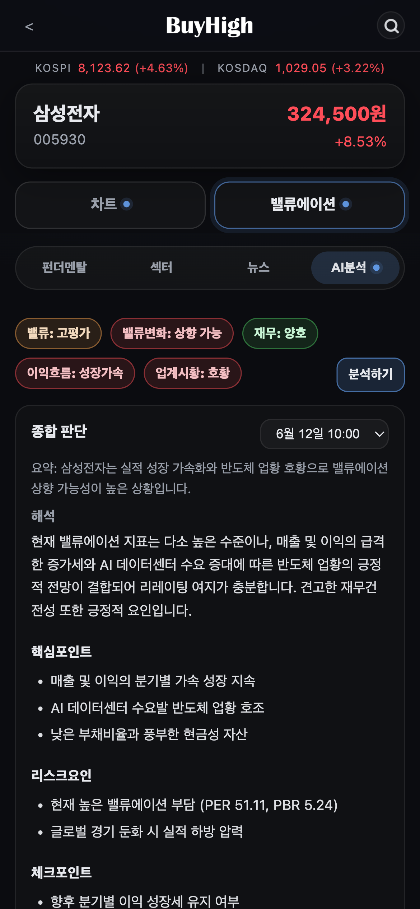
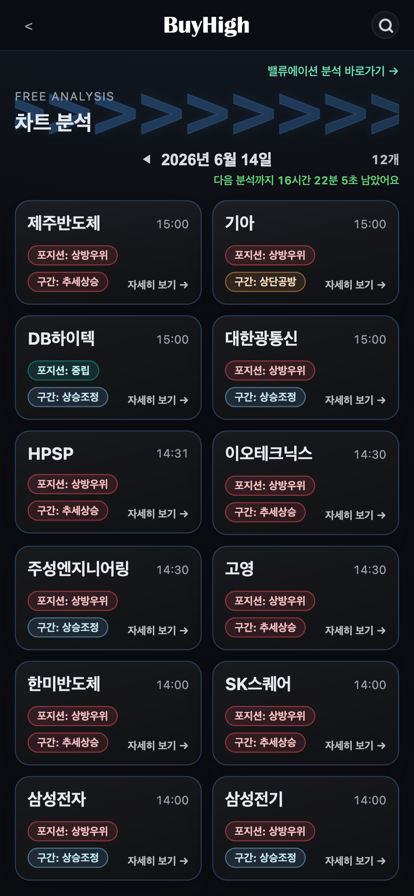
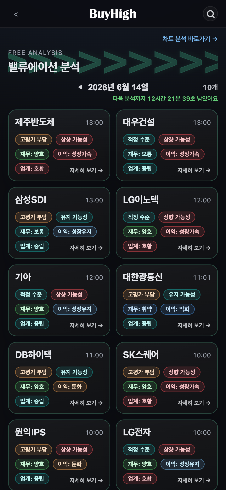

# 📈 BuyHigh

**無料の株式AI分析プラットフォーム**

チャート・バリュエーション分析からAIレポートまで、ひとつの場所で。

🔗 **[https://buyhigh.cc](https://buyhigh.cc)**

[한국어](README.md) · [English](README.en.md) · **日本語**

---

> ⚠️ **このリポジトリはプロジェクト紹介（README）専用です。**
> BuyHigh のソースコードは非公開であり、本リポジトリにはコードは含まれていません。
> サービスは上記のリンクから直接ご利用いただけます。

---

## 概要

**BuyHigh** は、韓国株の銘柄に対して **無料のAI分析レポート** を提供するWebプラットフォームです。
複雑なチャートや財務指標を、誰にでも理解できる分析レポートに変換します。

## 主な機能

- 📊 **チャート分析** — ローソク足・移動平均・出来高をAIが自然言語のレポートに解釈し、対応方針を提示
- 💰 **バリュエーション分析** — PER・PBR・ROE などの主要指標に基づく価値判断とリスク要因の整理
- 🎯 **銘柄推奨** — データに基づく売買アイデアと、ポジション・レンジのインサイト
- 🤖 **AIレポート** — 複数のLLM（GPT・Gemini）による銘柄分析の自動生成
- 🆓 **無料分析フィード** — 毎日更新されるチャート／バリュエーションの無料分析リスト

## スクリーンショット

### ホーム

### チャート分析

### バリュエーション分析

### 無料分析フィード

## 技術スタック

| 領域 | 使用技術 |
|------|-----------|
| Backend | Java 21, Spring Boot 3.5, Spring WebFlux, Spring Security |
| AI | Spring AI (OpenAI · Google GenAI), MCP Server |
| Frontend | Thymeleaf, HTML/CSS/JS |
| Data | Redis（セッション・キャッシュ） |
| Market Data | 韓国投資証券 Open API |
| Infra | Docker, Nginx, Cloudflare Tunnel |

## ライセンス・ソース

ソースコードは非公開（All rights reserved）であり、本リポジトリにはコードは含まれていません。
サービスに関するお問い合わせは Issue にてお願いします。

---

Made with ☕ by [JeongSeongMok](https://github.com/JeongSeongMok)

