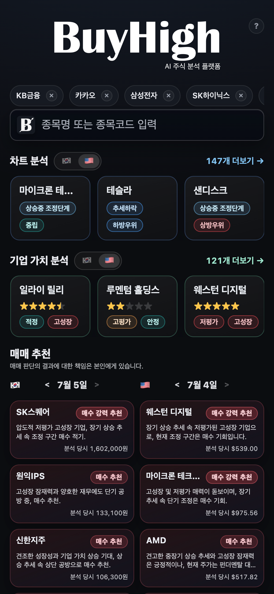
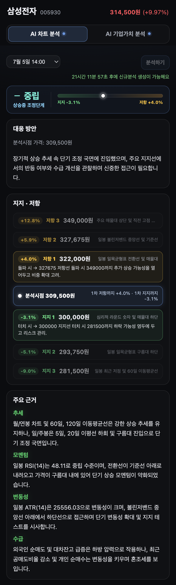
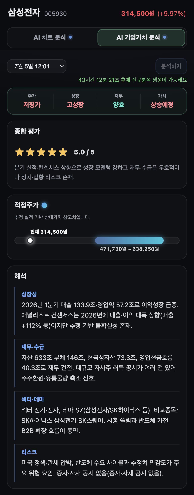

# BuyHigh

**無料の株式AI分析プラットフォーム**

チャート・バリュエーション分析からAIレポートまで、ひとつの場所で。

🔗 **[https://buyhigh.cc](https://buyhigh.cc)**

[한국어](README.md) · [English](README.en.md) · **日本語**

---

> ⚠️ **このリポジトリはプロジェクト紹介（README）専用です。**
> BuyHigh のソースコードは非公開であり、本リポジトリにはコードは含まれていません。
> サービスは上記のリンクから直接ご利用いただけます。

---

## 概要

**BuyHigh** は、韓国株・米国株の銘柄に対して **無料のAI分析レポート** を提供するWebプラットフォームです。
複雑なチャートや財務指標を、誰にでも理解できる分析レポートに変換します。

## 主な機能

- **チャートAI分析** — トレンド・モメンタム・ボラティリティ・需給を総合してポジション（上方・中立・下方）と局面を判定し、サポート・レジスタンスと対応方針を提示
- **バリュエーションAI分析** — 成長性・財務状態・企業価値を評価し、適正株価バンドを算出して割安/割高を判断
- **売買推奨** — チャート・バリュエーション分析を統合した買い/様子見/売りシグナルと、推奨時点以降のリターン追跡
- **韓国株・米国株対応** — KOSPI・KOSDAQ から NASDAQ・NYSE・AMEX 銘柄まで同じ分析を提供
- **インタラクティブチャート** — 移動平均・ボリンジャーバンド・一目均衡表・RSI などの指標を備えた銘柄詳細チャート
- **毎日の無料分析フィード** — 売買代金上位銘柄のレポートを毎日自動生成、ログイン不要で誰でも閲覧可能
- **マルチLLMエージェント** — Gemini・GPT エージェントが株価・需給・財務・ニュースデータを直接照会してレポートを作成

## スクリーンショット

### ホーム

### 分析

## 技術スタック

| 領域 | 使用技術 |
|------|-----------|
| Backend | Java 21, Spring Boot 3.5, Spring WebFlux, Spring Security |
| AI | Spring AI (OpenAI · Google GenAI), MCP Server |
| Frontend | Thymeleaf, HTML/CSS/JS |
| Data | Redis（セッション・キャッシュ） |
| Infra | Docker, Nginx, Cloudflare Tunnel |

## ライセンス・ソース

ソースコードは非公開（All rights reserved）であり、本リポジトリにはコードは含まれていません。
サービスに関するお問い合わせは Issue にてお願いします。

---

Made with ☕ by [JeongSeongMok](https://github.com/JeongSeongMok)

